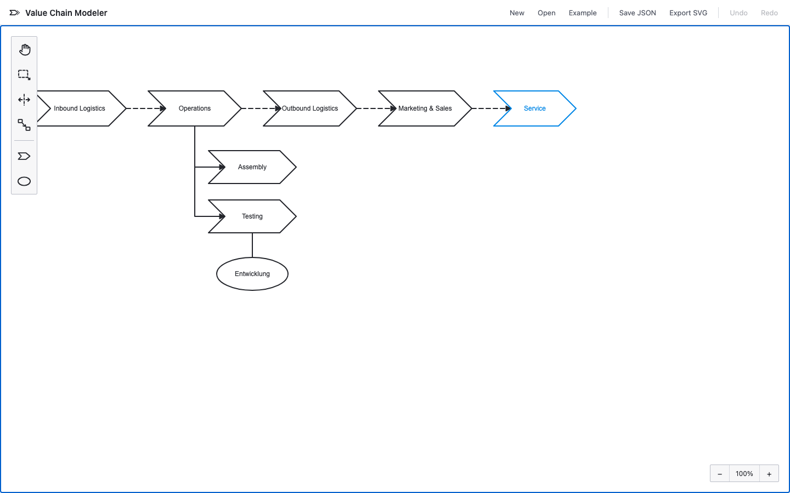

# Value Chain Modeler

A web-based editor for value chain diagrams
([Wertschöpfungskettendiagramme](https://de.wikipedia.org/wiki/Wertsch%C3%B6pfungskettendiagramm),
ARIS-style value-added chain diagrams), built on
[diagram-js](https://github.com/bpmn-io/diagram-js) with the look & feel of
[bpmn.io](https://bpmn.io/).



## Notation

- **Step** ("Wertschöpfungskette") — a right-pointing chevron / block arrow.
- **Organizational unit** ("Organisationseinheit") — an ellipse, assigned to a step.
- **is predecessor of** — sequence relation, dashed edge with an arrowhead.
- **is process-oriented superior** — hierarchy relation, solid edge with an arrowhead.
  Routing follows the sub-steps' arrangement: a horizontal row under the parent gets
  vertical drops, a vertical column gets the ARIS rake entering from the left.
- **assignment** — plain solid edge between an organizational unit and a step.

## Packages (npm workspaces)

| Package                             | Purpose                                                          | DOM |
| ----------------------------------- | ---------------------------------------------------------------- | --- |
| `@miragon/value-chain-schema-model` | Metamodel, Zod validation, migrations, stable JSON serialization | no  |
| `@miragon/value-chain-renderer`     | diagram-js viewer/modeler, chevron renderer, import/export, CSS  | yes |
| `apps/webapp`                       | Vite editor app                                                  | yes |
| `apps/vscode`                       | VS Code extension: custom editor for `*.vc.json`                 | yes |
| `e2e`                               | Playwright end-to-end tests against the webapp                   | yes |

## Quick start

```sh
npm install
npm run dev:webapp        # editor at http://localhost:5181
```

## Usage (library)

```ts
import { Modeler } from '@miragon/value-chain-renderer';
import '@miragon/value-chain-renderer/assets/value-chain.css';
import { createEmptyDocument } from '@miragon/value-chain-schema-model';

const modeler = new Modeler({ container: document.querySelector('#canvas') });
modeler.importDocument(createEmptyDocument('My value chain'));

const document = modeler.exportDocument(); // JSON document
const { svg } = modeler.saveSVG(); // standalone SVG
```

`Viewer` (read-only) and `NavigatedViewer` (read-only + zoom/pan) are exported as well;
`additionalModules` extends the DI container like in bpmn-js.

## Editor features

Palette (hand, lasso, space, connect tools + step/org-unit creation), context pad
(append successor, append sub-step, append org unit, typed connect, switch relation
type, color, delete), direct label editing (double-click / E), undo/redo, copy/paste,
snapping + grid snapping, bendpoints, keyboard shortcuts (H/L/S/C/E, arrows,
Ctrl+Z/Y/C/V), SVG export, JSON open/save, localStorage autosave.

## Commands

- `npm run build` — build the library packages · `npm run build:webapp` · `npm run build:vscode`
- `npm run dev:webapp` — editor at http://localhost:5181 · `npm run dev:vscode` — extension watch
- `npm test` — unit tests · `npm run test:browser` — Chromium integration tests ·
  `npm run test:e2e` — Playwright end-to-end
- `npm run lint` — ESLint + typecheck · `npm run depcruise` — module-graph rules
- `npm run format` — Prettier

Requirements: Node ≥ 22.13, npm. Contributor guide: [CONTRIBUTING.md](CONTRIBUTING.md).
